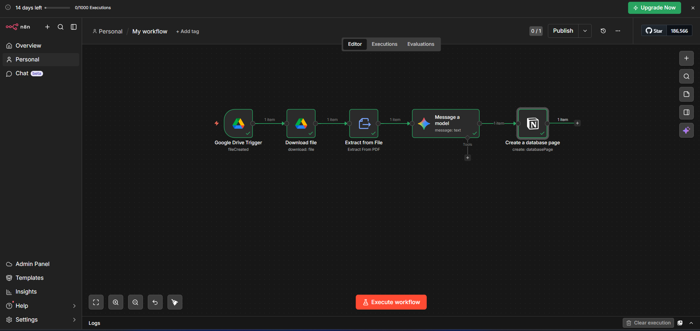
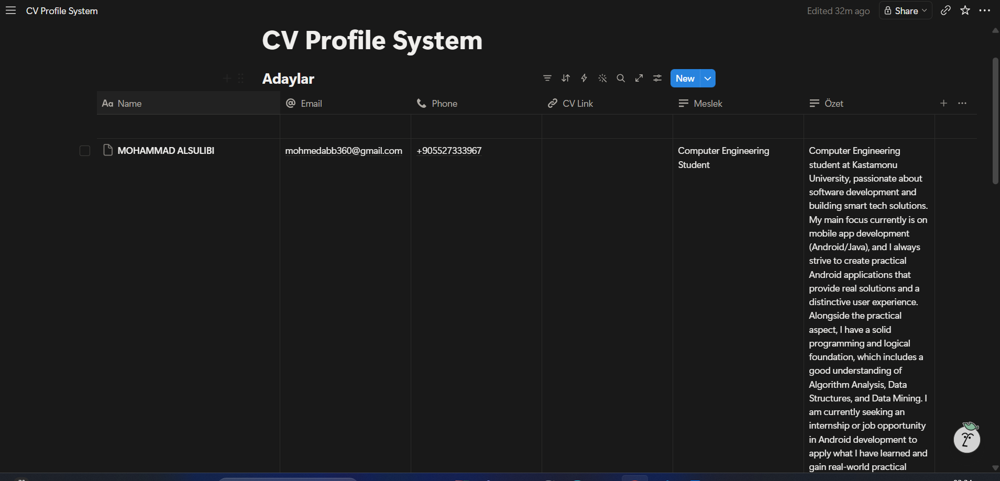

# Yapay Zeka Destekli Otomatik CV Analiz Sistemi
# AI-Powered Automated CV Analysis System

Bu proje, **n8n** kullanılarak geliştirilmiş tam otomatik bir özgeçmiş (CV) işleme sistemidir. Google Drive'a yüklenen PDF formatındaki aday özgeçmişleri sistem tarafından otomatik olarak çekilir, **Gemini 1.5 Flash API** ile analiz edilerek temel bilgiler (İsim, E-posta, Telefon, Meslek, Özet) çıkarılır ve yapılandırılmış bir şekilde **Notion** veritabanına kaydedilir.
    
This project is a fully automated CV processing system built with **n8n**. CVs uploaded as PDFs to Google Drive are automatically fetched, parsed using the **Gemini 1.5 Flash API** to extract key applicant data, and saved directly into a **Notion** database without human intervention.

## Sistem Mimarisi (System Architecture)
Aşağıdaki görsel, n8n üzerinde kurulan 4 aşamalı veri akışını göstermektedir:

## Uygulama ve Sonuç (Implementation & Result)
Aşağıdaki görsel, yapay zeka tarafından ayrıştırılan verilerin Notion veritabanına nasıl otomatik olarak aktarıldığını göstermektedir:

## Proje Dosyaları (Project Files)
Bu depoda bulunan dosyalar:
* `My_workflow.json`: n8n proje dosyası (İçe aktararak doğrudan çalıştırabilirsiniz).
* `Rapor_TR.pdf`: Proje detay raporu (Türkçe).
* `Report_EN.pdf`: Project detail report (English).
